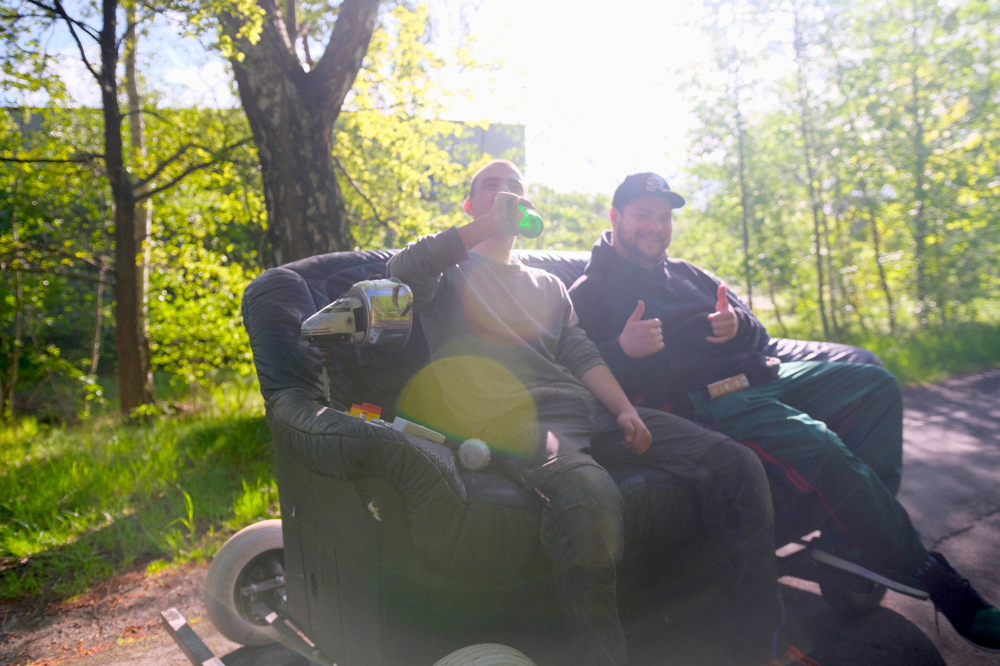

#DRIVING SOFA CONTROLS

Code for ESP8266 sofa WiFi remote controls. Four channel relay board and switches needed.

##Sofa specs

- 2kw 48V BLDC Motor
- 3,84 kWh Battery
- Air Horn with inbuilt compressor
- 0 - 100 km/h : no
- 35 km/h top speed
- 60 km range
- Comfortable
